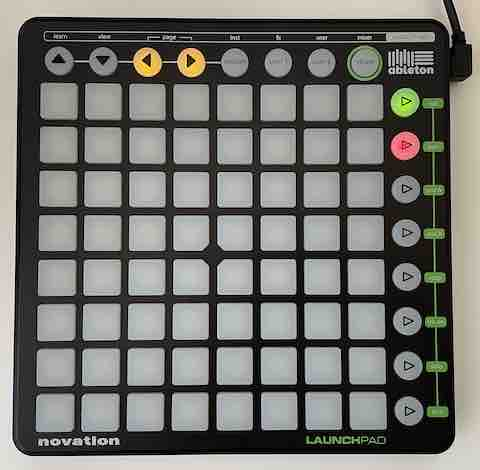

# Stream Pad

Use a Novation Launchpad[1](#fnd1) as an OBS Studio controller

### Supported features

- Scene selection (up to 8) & active scene status
- Scene cycling

### Dependencies

- A [Novation Launchpad](https://novationmusic.com/en/launch/launchpad-mini) device
- [OBS Studio](https://obsproject.com/)
- The [`obs-websocket`](https://github.com/Palakis/obs-websocket) plugin
- [Node.js](https://nodejs.org/en/)

Note: Ensure your Launchpad is connected and OBS is running (with `obs-websocket` active) before using this library

## Getting started

### ...by installing the global command

1. Run `npm install -g stream-pad`
2. Run `stream-pad`

If it can't connect to **obs-websocket**, you can supply the `--hostname`, `--port` and `--password` as arguments.

### ...by cloning this git repo

1. Clone this project
2. Run `npm install` (in the project directory)
3. Create a `.env` file in the project directory
4. Set relevant environment variables in `.env` (see `.env.example`)
5. Run `npm start`

### ...by installing this as a dependency in your own project

1. In your own project directory, run `npm install stream-pad`
2. In your project, import the `run` function (` const { run } = require('stream-pad);`)
3. Call `run` with up to 3 optional arguments (`obs-websocket`'s `hostname`, `port` & `password`);

In all cases, `obs-websocket`'s default `hostname` is `"localhost"`, and the default port is `4444`;

## Usage

- The ▷ buttons are mapped to your first 8 scenes; pressing will request a scene change
  - 🔴 = Inactive scene
  - 🟠 = Requested scene
  - 🟢 = Active scene
- Pressing the ◀ and ▶ buttons loop forwards/backwards through your scenes

## Underlying libraries

- [`launchpad-mini`](https://github.com/Granjow/launchpad-mini)
- [`obs-websocket-js`](https://github.com/obs-websocket-community-projects/obs-websocket-js)

## Footnotes

1.  Successfully tested with the original Launchpad (MK1), but the library was designed for the Launchpad Mini
